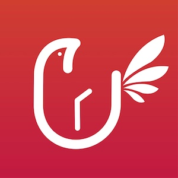

# 다연결 | 대학교 공지사항 알리미

## 프로젝트 기간

2018.12 ~ 현재

## 제공하는 기능

- 학교별 공지 확인
- 키워드 하이라이팅
- ~~키워드 푸시 알림~~ 준비중

## 사용하는 라이브러리

### Rx

- ReactorKit
- RxCocoa
- RxDataSources
- RxGesture
- RxOptional
- RxSwift

### 기타

- Carte
- Firebase/Core
- Firebase/Messaging
- Kanna
- SnapKit
- Then
- XLPagerTabStrip

## 대학교 파싱 모델 정의 방법

[Wiki](https://github.com/presto95/UniTice/wiki/%EB%8C%80%ED%95%99%EA%B5%90-%ED%8C%8C%EC%8B%B1-%EB%AA%A8%EB%8D%B8-%EC%9E%91%EC%84%B1%ED%95%98%EA%B8%B0)를 참고해 주세요.

## 지원 대학교

**A**

KAIST

KC대학교

**ㄱ**

강남대학교

강원대학교

경북대학교

경상대학교

경성대학교

경희대학교

고려대학교

광운대학교

국민대학교

**ㄴ**

**ㄷ**

대진대학교

덕성여자대학교

동국대학교

동덕여자대학교

동신대학교

**ㄹ**

**ㅁ**

명지대학교

목포대학교

**ㅂ**

부경대학교

부산대학교

**ㅅ**

삼육대학교

서경대학교

서울과학기술대학교

서울교육대학교

서울대학교

서울여자대학교

성결대학교

성공회대학교

성균관대학교

성신여자대학교

세종대학교

세한대학교

숙명여자대학교

**ㅇ**

우석대학교

이화여자대학교

**ㅈ**

전남대학교

전북대학교

제주대학교

**ㅊ**

총신대학교

충남대학교

충북대학교

**ㅋ**

**ㅌ**

**ㅍ**

**ㅎ**

한국산업기술대학교

한국예술종합학교

한국외국어대학교

한성대학교

한양대학교

홍익대학교
